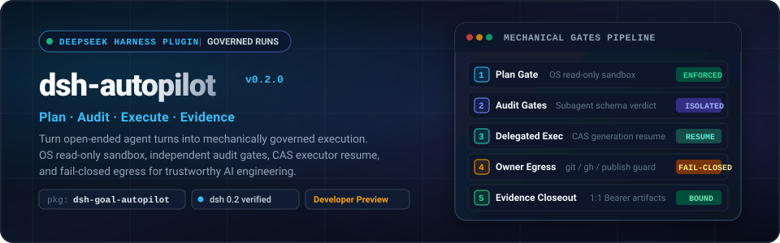
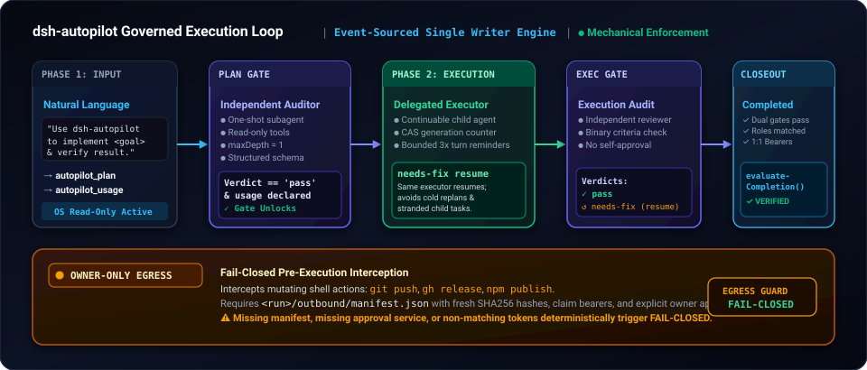

<p align="right">
  <a href="./README.md">English</a> · <strong>简体中文</strong>
</p>

<p align="center">
  <a href="#工作流程与架构"></a>
</p>

<p align="center">
  <a href="https://www.npmjs.com/package/dsh-goal-autopilot"></a>
  <a href="./LICENSE"></a>
  <a href="./docs/compatibility.md"></a>
  <a href="https://github.com/My-Denia/dsh-autopilot-public/actions/workflows/ci.yml"></a>
  <a href="#状态与验证边界"></a>
</p>

<p align="center">
  <a href="#为什么需要-dsh-autopilot"><b>解决什么问题</b></a> &nbsp;·&nbsp;
  <a href="#工作流程与架构"><b>工作流程与架构</b></a> &nbsp;·&nbsp;
  <a href="#快速开始"><b>快速开始</b></a> &nbsp;·&nbsp;
  <a href="#核心能力"><b>核心能力</b></a> &nbsp;·&nbsp;
  <a href="#状态与验证边界"><b>状态与验证边界</b></a> &nbsp;·&nbsp;
  <a href="#深度文档"><b>深度文档</b></a>
</p>

---

> [!IMPORTANT]
> **项目名称与分发渠道说明：** 本项目的逻辑名称为 **dsh-autopilot**。官方 npm 发布包名为 [**`dsh-goal-autopilot`**](https://www.npmjs.com/package/dsh-goal-autopilot)。npm 上的无 scope 名称 `dsh-autopilot` 属于另一个无关的独立项目；在 DSH 插件管理器或命令行安装时，请务必指定安装 **`dsh-goal-autopilot`**。

## 为什么需要 dsh-autopilot？

代码宿主内的自主 LLM Agent 固然强大，但在没有明确治理的开放式会话中极易失控：Agent 常常在未确认需求前就动手写文件、自审自夸生成无检验的代码、在审查被拒后丢弃上下文重新开盲盒，甚至在没有人类确认的情况下悄悄执行不可逆操作（如 `git push` 或发包）。

**dsh-autopilot** 将 Claude Code 侧验证成熟的 `goal-autopilot-harness` 治理设计，重构为 [DeepSeek Harness](https://github.com/deepseek-ai/deepseek-harness) (dsh) 的原生插件套件。与单纯依赖提示词约定的脆弱做法不同，本项目的门禁是由 **dsh 插件缝隙中的结构性不变量** 机械化强制执行的：

| 无治理的 Agent 执行流 | 由 dsh-autopilot 机械治理 |
| :--- | :--- |
| **抢跑写文件**<br>收到 Prompt 立即修改源码，未经规划与需求确认。 | **结构性计划门禁 (Plan Gate)**<br>引擎层直接拦截写/改工具，并在规划期将会话沙盒置为 OS 级 `read-only` 只读模式，计划审计通过前不可能改写磁盘。 |
| **自导自演虚假评审**<br>同一个模型自己写自己审：*“我仔细看过了，改动非常完美。”* | **隔离子代理审计 (Independent Audits)**<br>通过独立上下文的一次性子代理执行评审，只分配只读工具，且必须返回结构化 JSON 裁决 (`pass` / `needs-replan`)，未获通过绝不翻转门禁。 |
| **审查失败上下文丢失**<br>审查指出错误后直接新开 Agent 重跑，遗失历史推导过程与修改上下文。 | **CAS 世代执行器就地恢复**<br>指派具备 CAS 世代号的单一可延续子代理；在收到 `needs-fix` 时就地唤醒同一执行器继续修复，杜绝孤儿任务与无底洞分支。 |
| **私自出站与破坏性动作**<br>Agent 自主执行 `git push`、改动远程 tag、甚至发布 npm 包。 | **Owner-Only 出站拦截 (Fail-Closed Egress)**<br>在执行层对 `git`、`gh`、`npm publish` 等出站写命令实施 fail-closed 拦截，必须持有包含新鲜哈希的 `manifest.json` 与明确的人类所有者授权。 |
| **空头支票式完成宣告**<br>没有任何验证依据就宣称 *“任务已全部完成”*。 | **证据绑定收尾 (Evidence-Bound Closeout)**<br>收尾状态机严格校验：双重门禁必须全 pass、必需角色齐全、且每条验收标准必须在磁盘上持有 1:1 的证据载体文件方可置为 `completed`。 |

---

## 工作流程与架构

<p align="center">
  
</p>

标准治理运行遵循全快照事件溯源状态机（`planning` → `plan-reviewing` → `executing` → `execution-reviewing` → `completed`）：

1. **自然语言目标派发**  
   用户使用自然语言下达任务指令。引擎在 `goal-runs/<slug>/` 初始化运行目录，将会话沙盒置入 `read-only` 模式，锁定一切文件改写动作。
2. **第一阶段：规划与使用声明**  
   主控代理制定紧凑合约（目标、范围、非目标、风险等级、里程碑及验收标准），并通过 `autopilot_usage` 明确声明人可观测的状态边界。
3. **计划门禁（独立审计）**  
   宿主派发独立的审计子代理（只读工具集、`maxDepth: 1`）。只有在收到结构化的 `pass` 裁决且所有使用维度均已声明绑定时，计划门禁才落盘放行。
4. **第二阶段：委托执行与就地恢复**  
   指派专职可延续子代理在 CAS 世代号保护下落实实现。若后续审计提出 `needs-fix`，调度器唤醒同一个执行器进行针对性修复，避免丢弃上下文。
5. **第三阶段：执行审计与证据绑定收尾**  
   独立的执行审计子代理对交付成果进行二进制核查。引擎的 `evaluateCompletion()` 严格确保：双门禁 pass、角色匹配无遗漏、每条验收标准具备磁盘上的凭据载体文件，方可完成收尾。
6. **全程出站拦截守卫**  
   涉及远程状态改写的 Shell 命令（如 `git push`、`gh release`、`npm publish`）在执行前被无条件拦截。只有凭据清单（`manifest.json`）与人类所有者批准齐备时才予放行，否则确定性 fail-closed 拒绝。

---

## 快速开始

运行环境需 **[dsh](https://github.com/deepseek-ai/deepseek-harness)** `0.2.0`（或 `0.1.2-rc.1` / `0.1.5-rc.1`）及 **Node 22+**。

### 1. 安装插件

#### DeepSeek Harness 桌面客户端
在桌面端侧边栏打开 **Settings（设置）→ Plugins（插件）→ Add plugin（添加插件）**，输入安装源：
```text
dsh-goal-autopilot@0.2.0
```
点击 **Install（安装）**，安装成功后选择 **Enable now（立即启用）**。如宿主提示需要重启，请重启桌面客户端。

#### 命令行 / 无头服务 / Web 模式
直接在终端为你当前使用的配置 profile 安装最新版本：

```sh
# 为活跃 profile（如 web 或自定义 profile）安装
dsh plugin --profile <name> add dsh-goal-autopilot@0.2.0
```

### 2. 发起首个治理任务

在对应 profile 的对话会话中，直接以自然语言发起目标：

```text
Use dsh-autopilot to implement <你的工程目标> and verify the result.
```

插件引擎将自动初始化治理运行、开启只读沙盒钳制、调度独立子代理进行审计、并在收尾时校验凭据完整性。如需手动调用或深入了解内部 `autopilot_*` 系列工具，可查阅 [操作员参考手册](./docs/reference.md)。

---

## 核心能力

- 🛡️ **结构性计划门禁 (Plan Gate)**  
  标准任务在独立计划审计通过前无法修改任何文件。引擎级 PreToolUse 守卫拦截一切 write/edit 调用，且在规划期激活 OS 层只读沙盒。
- ⚖️ **严格隔离的子代理审计**  
  审计子代理与规划/执行上下文完全隔离，受限为只读工具且 `maxDepth: 1`。审计结果直接带内返回结构化数据（`pass`、`needs-replan`、`blocked`），不凭模型文本自觉推断。
- 🔄 **同一执行器就地修复 (`needs-fix`)**  
  针对审计指出的缺陷，直接恢复同一位执行器子代理，保留已有的推导与环境认知，防止因新开代理导致的任务漂移与孤儿进程。
- 🛑 **Fail-Closed 出站拦截守卫**  
  任何外发或推送动作（`git push`、`gh release`、`npm publish`）均需经由包含密码学 SHA-256 校验的 `manifest.json` 清单及所有者明确授权。缺失服务或未授权一律阻断。
- 📜 **证据绑定收尾机制**  
  绝不凭一句口头“完成”了事：`evaluateCompletion()` 强制要求双重门禁通关、执行模式出处一致、且每条验收标准在磁盘上有确切的凭证载体。
- ⏱️ **执行催促提醒与使用维度声明**  
  原生监听并在执行期意外中断时提供最多 3 次有界催促提醒；强制所有标准任务在门禁翻转前明确声明人可观测的使用验证维度。

---

## 状态与验证边界

为了保持严肃开源项目的工程可信度，以下是我们明确已验证与未验证的边界事实：

| 维度 | 当前客观事实 |
| :--- | :--- |
| **成熟度** | **实验性开发者预览版 (Developer Preview)**，非生产就绪发布。 |
| **npm 分发渠道** | [`dsh-goal-autopilot@0.2.0`](https://www.npmjs.com/package/dsh-goal-autopilot) |
| **宿主兼容范围** | 支持 `dsh` 0.2.0 系列、`0.1.5-rc.1`、`0.1.2-rc.1`（0.1.7 与 0.2.1 在兼容范围之外）。 |
| **WSL2 + 0.2.0-rc.2 实测** | **已验证：** 插件安装、挂载、Skill 注册、计划审计、委托执行器派发及 needs-fix 就地恢复，均在真实 dsh 0.2.0-rc.2 宿主 + 本地 mock 模型下实测通过。 |
| **真实模型全流程收口** | **未验证：** 自然语言完整真实写代码 → 真实模型执行审计 → 完整收尾结项流程尚未在真实模型下跑通实测。 |
| **桌面端打包 (macOS / Windows)** | **未验证：** 本项目测试环境为 WSL2，未启动测试桌面端图形界面应用打包。 |
| **Windows 原生环境** | **未验证：** 未在原生 Windows 宿主环境下测试，不声明支持。 |
| **前端卡片渲染与冷恢复识别** | **未验证：** 会话卡片渲染与冷重启后的执行器身份重新识别仍处于实验性未完全验证状态。 |
| **发布与制品渠道** | **npm 是安装包分发渠道**；GitHub Release 仅承载发布更新日志（notes-only），不挂载独立编译 tarball。 |
| **安全保障范畴** | 提供质量门禁、沙盒模式钳制与 fail-closed 出站拦截；不构成抵御恶意不可信代码的完整安全边界。 |

详细的兼容性矩阵、0.2.0 适配改动及沙盒残留说明，请参阅 [docs/compatibility.md](./docs/compatibility.md)。

---

## 深度文档

| 文档名称 | 核心内容 |
| :--- | :--- |
| **[DESIGN.md](./DESIGN.md)** | 完整系统设计、从 CC GAH 到 dsh 的架构映射、状态机规范及不可机械化不变量。 |
| **[docs/compatibility.md](./docs/compatibility.md)** | DSH 各版本兼容性矩阵、桌面端说明、0.2.0 适配细节与测试覆盖说明。 |
| **[docs/security.md](./docs/security.md)** | 授权机制、出站命令拦截、沙盒边界假设与明确非目标。 |
| **[docs/reference.md](./docs/reference.md)** | 操作员工具协议 (`autopilot_*`)、运行状态数据模型及使用类定义。 |
| **[CHANGELOG.md](./CHANGELOG.md)** | 完整版本发布历史与更新记录。 |

---

## 本地开发与验证

```sh
# 克隆仓库代码
git clone https://github.com/My-Denia/dsh-autopilot-public.git
cd dsh-autopilot-public

# 安装依赖并构建插件 bundle
pnpm install
npm run build

# 执行类型检查与单元测试
npm run check
npm test

# 链接至本地 DSH profile 进行功能调试
dsh plugin --profile dev add .
```

---

## 开源协议

基于 [MIT License](./LICENSE) 开源，© 2026 My-Denia。
